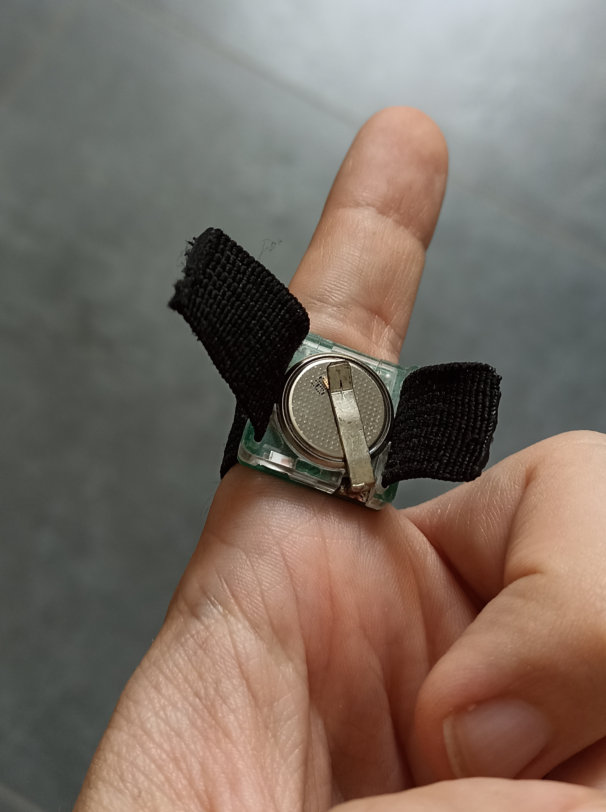
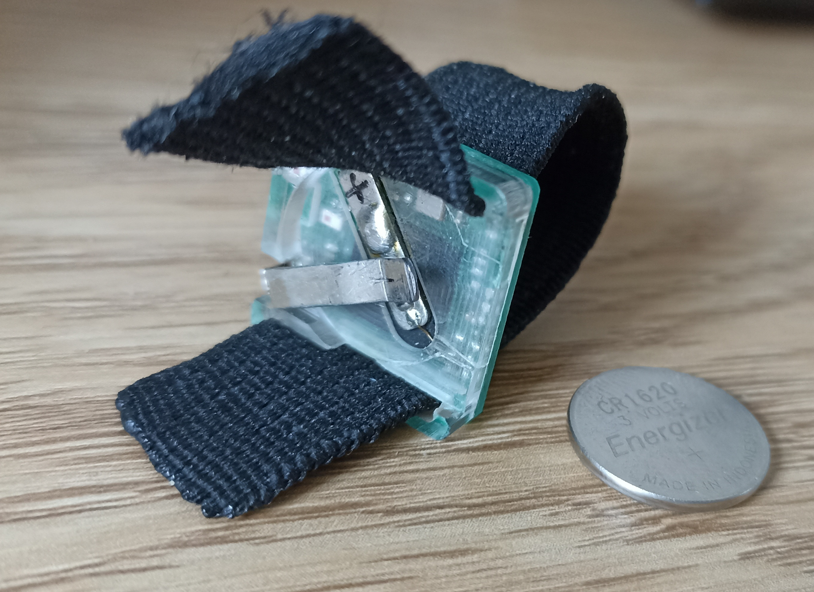
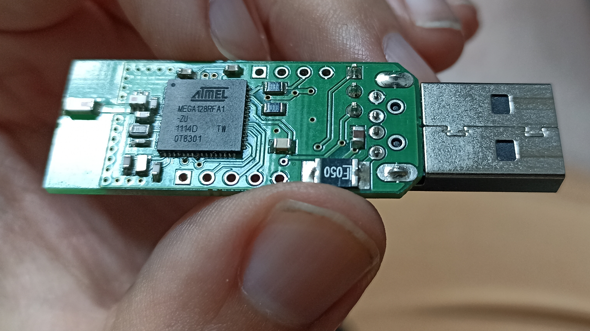
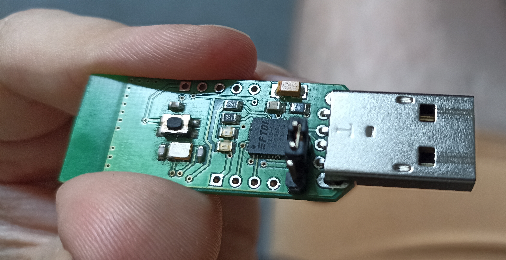

# OperatorSense Live — EDA Ring: Technical Documentation

Technical description of the EDA measurement kit (sensor ring + USB dongle) and of
`operatorsense_live.html`, the browser application used to read, record and export its data.

---

## 1. What the system is

| Part | Function |
|---|---|
| **EDA ring** | Finger-worn sensor. Measures skin resistance and transmits it by 2.4 GHz radio. |
| **USB dongle** | Receives the radio packets and outputs them as ASCII lines on a USB virtual COM port. |
| **`operatorsense_live.html`** | Reads that COM port in Chrome/Edge, displays the signal live, records it, exports CSV, and can POST the capture to a server. |
| **`CALIBRATION.xlsx`** | Measured ADC-code → resistance table for both rings (implemented in the app, see [§5](#5-calibration-adc-code--resistance--conductance)). |
| **`foto/`** | Photographs of the ring and the dongle. |

### Signal chain

```
  ┌──────────────┐   2.4 GHz radio    ┌────────────────────────┐   USB (virtual COM)   ┌───────────────────┐
  │   EDA ring   │ ─────────────────► │      USB dongle        │ ────────────────────► │   Chrome / Edge   │
  │              │  IEEE 802.15.4     │                        │  38400 baud, 8/N/1    │                   │
  │ ATMEGA128RFA1│  proprietary       │ ATMEGA128RFA1 receiver │  ASCII text lines     │ operatorsense_live│
  │ skin-resist. │  packet format     │  + FTDI FT232RQ        │                       │ .html (Web Serial)│
  │ measurement  │  (undocumented)    │    USB-serial bridge   │                       │                   │
  └──────────────┘                    └────────────────────────┘                       └───────────────────┘
                                                                                                 │
                                                                              CSV file  ◄────────┼────────►  HTTP POST
                                                                              (local)            │           (JSON, optional)
```

**The dongle is required.** Android cannot read the ring directly — see
[§3](#3-radio-link-between-ring-and-dongle).

---

## 2. Hardware

### 2.1 Chips

| Device | Chips |
|---|---|
| Ring | **ATMEGA128RFA1** — 8-bit AVR microcontroller with an integrated 2.4 GHz IEEE 802.15.4 transceiver. |
| Dongle | **ATMEGA128RFA1** (radio receiver) + **FTDI FT232RQ** (USB-to-serial converter). |

The FTDI chip enumerates as a standard virtual COM port, so no vendor driver is needed on current
Windows/macOS/Linux, and the browser can open it via the Web Serial API.

- **USB vendor ID:** `0x0403` (FTDI) — used by the app to filter the port chooser.
- **Serial settings:** **38400 baud, 8 data bits, no parity, 1 stop bit, no flow control.**

The kit is an uncertified prototype: no FCC ID or equivalent approval exists.

### 2.2 Ring

A small potted PCB carried on a black elastic strap with a hook-and-loop closure; the strap is what
holds it on the finger and lets one unit fit different finger sizes.

**Worn**



**Opened, cell removed**



- The electronics are encapsulated in a **clear potting compound**, so the board is sealed but its
  components stay visible. The strap is threaded through slots at both ends of the module.
- **Power: one `CR1620` 3 V lithium coin cell**, held by a soldered metal spring clip. The cell is
  user-replaceable and sits on the outward-facing side of the module.
- There is **no charging connector and no power switch** — the ring runs whenever a cell is fitted,
  and pulling the cell out of the clip is the only way to switch it off. Battery life is undocumented
  (see [§9](#9-open-technical-questions)).
- The skin-contact electrodes are on the underside, against the finger; they are not visible in these
  photographs. *(Assumed from the placement of the cell on the opposite face.)*

**Handling**

- Slide the cell out of the clip when the kit is stored, otherwise the ring keeps transmitting and
  drains the battery.
- Seat the module against the skin firmly but without over-tightening the strap — a ring that loses
  skin contact shows up as a frozen reading (see [§6.6](#66-troubleshooting)).

### 2.3 Dongle board

Unenclosed PCB with a USB-A plug soldered directly onto it.

**Top side — radio**



- QFN chip marked **`ATMEL MEGA128RFA1-ZU`**, additional markings `1114D TW / 0T8301`
  (`1114` read as a date code = about week 11 of 2011).
- The end opposite the USB plug carries a **PCB trace antenna** etched into the copper; there is no
  external aerial.

**Bottom side — USB interface**



- **FTDI** USB-to-serial converter, a crystal and passives.
- A **tactile push button** — it **does not reset the microcontroller**. Verified by holding it for
  8 seconds three times with the serial port open: the packet stream continued undisturbed at its
  3.1 s cadence, without a single gap and without any change to the line contents. Either it is not
  connected, or the firmware ignores it. It is not needed in operation and is harmless.
- A row of **unpopulated through-holes**, most likely a programming/debug header (ISP or JTAG) — the
  only route to the chip's memory, see [§8](#8-firmware).
- **The FTDI converter's DTR and RTS lines are not wired to reset.** Verified by pulsing both: the
  data stream did not break. This means **the computer has no way to reset or disturb the dongle** —
  no software can reach the microcontroller over USB.

**Handling**

- The board is exposed: hold it by the USB connector, treat it as ESD-sensitive.
- Keep the antenna end clear of fingers, laptop chassis and metal surfaces. A short USB extension
  cable that moves the dongle away from the computer is the simplest way to improve range and link
  stability.

---

## 3. Radio link between ring and dongle

| Property | State |
|---|---|
| Protocol | Proprietary 2.4 GHz protocol on the IEEE 802.15.4 physical layer, possibly Thread/ZigBee-derived. **Not** Bluetooth, BLE or ANT. *(Developer's assessment, unconfirmed.)* |
| Frequency band | 2.4 GHz. |
| Pairing | None — **measured**. The dongle was unplugged five times during testing and the link came back by itself every time, immediately and without intervention. Ring and dongle have fixed addresses (see [§4.2](#42-fields)). |
| GATT services / UUIDs | Not applicable — no BLE layer exists. |
| SDK / API | None. The dongle's serial output is the only interface. |
| Encryption | **Unknown.** Determinable only by capturing a radio frame with an 802.15.4 receiver, which we do not have. Not material to describing what the device currently does. |

**Reading from Android is not possible.** Neither a phone nor a tablet has an 802.15.4 radio, and the
ring exposes no BLE profile, so the only route to the data is through the dongle attached to a
computer.

---

## 4. Serial output format

The dongle emits plain ASCII text, one line per received measurement.

### 4.1 Example line

```
D8730:01[CEE3];CAFE;1068
```

### 4.2 Fields

| Field | Example | Meaning | Confidence |
|---|---|---|---|
| Packet identifier | `D8730` | **Constant**, not a counter | Measured |
| Channel | `01` | Radio channel, constant | Measured (meaning assumed) |
| Dongle address | `CEE3` | Receiver address, constant | Measured (meaning assumed) |
| Ring address | `CAFE` | Sender address, constant | Measured (meaning assumed) |
| Value | `1068` | **ADC code of the measured resistance** | Confirmed |

**The first four fields are static identifiers.** Across a 1,054-sample capture spanning 67 minutes,
and in every later measurement, not one of them changed. The developer's original assumption that
`D8730` changes from packet to packet was not borne out by measurement — **packet loss therefore
cannot be detected from these fields.**

Every line has a **fixed length of 24 bytes** (23 characters + terminator).

The application reads **the integer after the last `;`** as the value, so it keeps working even if the
leading fields are later interpreted differently.

### 4.3 Line terminator and sampling rate

- **Terminator: a bare `LF` (0x0A), no `CR`.** Measured on the raw bytes from the serial port; not a
  single invalid byte occurred in the whole capture. The app nevertheless accepts `\r\n`, `\r` and
  `\n` and buffers any incomplete tail until the rest of the line arrives.
- **Sampling period: 3.101 s (≈ 0.32 Hz).** Measured over 965 intervals; standard deviation 20 ms.
  The period is immovable — it holds both with the contacts shorted and with the circuit open. The app
  also measures the rate live from the last 50 packets and displays it as Hz and s/sample.

**The phase re-anchors after every dropout.** If transmission drops out briefly, the packets that
follow do not resume on the original grid but on a new one — most often shifted by **±1.03 s, exactly
one third of the period**. In the 67-minute capture the phase shifted at 24 of 34 dropouts.

> **Consequence for data processing:** samples cannot be placed on a regular time grid. Always work
> with the actual timestamps from the export.

### 4.4 Value range and the meaning of 65535

The converter is **16-bit**; the verified range of observed values is **2 to 65535**.

**The value 65535 (0xFFFF) means an open circuit — i.e. no valid measurement.** It is not a special
code from the firmware but **converter saturation**: the resistance exceeded the measurable range.
Confirmed by the trace recorded after taking the ring off the finger, where the value climbed
smoothly to the ceiling as moisture dried off the electrodes:

```
615 → 1945 → 5144 → 9121 → 13994 → 20321 → 28050 → 36903 → 46515 → 55097 → 65535
```

> **Consequence for data processing:** samples with the value 65535 must be filtered out before
> analysis. The 67-minute capture contained **312 of 1,054, i.e. 29.6%**, and in long contiguous runs
> (98, 61, 52, 42, 25 and 24 samples back to back). The median comes out at 3,140 with the sentinels
> included and 2,146 without them. The stretch just before saturation has to be cut too — about 100
> seconds pass between the loss of contact and the ceiling being reached, and during them the values
> look like a valid measurement.

---

## 5. Calibration: ADC code → resistance → conductance

The transmitted value is a raw ADC code, not ohms. Reference resistors were connected to each ring
and the reported code recorded; the result is `CALIBRATION.xlsx`:

| R [kΩ] | ADC code — ring `CAFE` (band) | ADC code — ring `CAD1` (no band) |
|---:|---:|---:|
| 0.55 | – | – |
| 1 | 3 | 3 |
| 2.2 | 9 | 10 |
| 5.55 | 27 | 28 |
| 8.19 | 40 | 42 |
| 17.9 | 93 | 96 |
| 38.9 | 212 | 212 |
| 68.3 | 361 | 377 |
| 100.2 | 554 | 550 |

**Two rings, two columns** — they calibrate slightly differently. The ring address is present in every
packet, so the app selects the matching column automatically; an unknown address falls back to `CAFE`
and is marked as a fallback in the upload payload.

How the app converts (code at the top of `operatorsense_live.html`):

- **Between table points:** linear interpolation. The response is close to but not exactly linear
  (the code-per-kΩ ratio drifts from 3.0 to 5.5), so the piecewise table is more accurate than a
  single fitted line.
- **Outside 1–100.2 kΩ:** linear extrapolation from the nearest segment. Such values are estimates
  and are flagged everywhere: `(extrapolated)` in the live readout, `in_calibrated_range` in the CSV,
  `inCalibratedRange` in the JSON. **Skin readings usually land above the calibrated span**
  (code 1068 ≈ 185 kΩ), so the flag appears often — it marks calibration coverage, not an error.
- **Below the calibrated span:** the 0.55 kΩ row reads `–` in the table. That does not mean the device
  reports nothing — **values as low as 2 have been measured in operation**, far below the first
  calibration point. The dash evidently means the developer could not get a stable reading there, not
  that the output is missing.
- **Conductance:** `µS = 1 000 000 / Ω`. Microsiemens is the standard unit for EDA analysis and the
  unit the VitalWork Android app uses for its Galaxy Watch EDA channel, so the two are directly
  comparable.

The raw ADC code is kept in every export next to the converted values, so data can be re-converted if
the calibration is revised.

**Adding another ring:** append its address and measured pairs to `CALIBRATION_TABLES` in
`operatorsense_live.html`. Nothing else changes.

---

## 6. The `operatorsense_live.html` application

A single self-contained HTML file — no installation, no server, no dependencies. It reads the dongle
through the browser's **Web Serial API**.

### 6.1 Requirements

- **Desktop Chrome or Edge.** Firefox, Safari and mobile browsers do not implement Web Serial; the
  page shows a warning banner if unsupported.
- The dongle plugged in.

### 6.2 Screen layout

| Section | Contents |
|---|---|
| Top bar | Connect / Disconnect, baud selector (default 38400), 8/N/1 note, connection status. |
| Stat cards | Current raw ADC value, converted kΩ and µS, min / max / average, sample rate (Hz, s/sample), duration, recorded samples, event count. |
| Live signal | Rolling chart of the last 600 samples with event markers, plus a decoded view of the last packet. |
| Recording & export | Start/Stop recording, Mark event, Download CSV, Send to server, Clear recording, and the server settings. |
| Raw serial log | Last 200 lines exactly as received — the first place to look when something behaves oddly. |

### 6.3 Workflow

1. **Connect dongle** — the browser shows a port chooser filtered to FTDI devices (cancelling it
   opens an unfiltered chooser). Live graph and statistics start immediately.
2. **Start recording** — every sample is stored with a timestamp from here on. Watching the live
   graph does not require recording.
3. **Mark event** *(optional, while recording)* — prompts for a label (e.g. `touch`, `stimulus`) and
   places a marker on the chart and into the export, attached to the nearest sample in time.
4. **Stop recording** — captured data stays in memory.
5. **Download CSV** and/or **Send to server**.
6. **Clear recording** before the next run.

**Buffer behaviour:** downloading the CSV does **not** empty the buffer. Starting a second recording
without pressing *Clear recording* puts both runs in one file. Disconnecting the dongle stops
recording but keeps the data, so a capture can still be exported or uploaded afterwards.

### 6.4 CSV export

File name: `operatorsense_capture_<timestamp>.csv`.

```
timestamp_iso, epoch_ms, elapsed_ms, value_adc, resistance_ohm, conductance_us,
in_calibrated_range, packet_id, channel, dongle_addr, ring_addr, event, raw
```

| Column | Meaning |
|---|---|
| `elapsed_ms` | Milliseconds since the first recorded sample. |
| `value_adc` | Raw code as transmitted, never modified. |
| `resistance_ohm`, `conductance_us` | Converted via the ring's calibration table ([§5](#5-calibration-adc-code--resistance--conductance)). |
| `in_calibrated_range` | `1` inside 1–100.2 kΩ, `0` when extrapolated. |
| `event` | Label of any marker falling on that sample. |
| `raw` | Original serial line, kept for re-parsing. |

### 6.5 Server upload

The upload path is implemented but points at no server by default — nothing is transmitted until an
endpoint is entered.

**Configuration** — open **⚙ Server settings** in the Recording & export panel:

| Field | Meaning |
|---|---|
| Endpoint URL | Target of the `POST`, e.g. `https://api.example.org/v1/eda/captures`. |
| Authentication | `Bearer token` (`Authorization: Bearer …`), `API key header`, or `None`. |
| API key / token | Credential issued by the server. |
| API key header name | Header used with the API-key scheme; default `X-API-Key`. |
| Session label | Optional text sent with every capture. |

**Save settings** stores them; **Test connection** sends an empty payload with `"test": true` to
verify URL and credentials without data; **Forget credentials** clears them. Settings live in that
browser's `localStorage` (key `operatorsense.upload.v1`). To ship a pre-configured copy, fill in
`UPLOAD_DEFAULTS` at the top of the script — saved settings still take precedence.

**Payload** — one JSON `POST` per capture:

```json
{
  "schemaVersion": "1.0",
  "source": "OperatorSense Live (EDA ring, FTDI Web Serial)",
  "sentAtIso": "2026-08-18T09:12:33.120Z",
  "test": false,
  "capture": {
    "captureId": "os-20260818T091120-4f3a",
    "label": "operator-07",
    "startedAtIso": "2026-08-18T09:11:20.000Z",
    "endedAtIso": "2026-08-18T09:12:21.234Z",
    "durationMs": 61234,
    "sampleCount": 612,
    "eventCount": 3,
    "baudRate": 38400
  },
  "device": { "dongleAddr": "CEE3", "ringAddr": "CAFE", "usbVendorId": "0x0403" },
  "signal": {
    "unit": "raw_adc",
    "ohmsAvailable": true,
    "calibration": {
      "source": "CALIBRATION.xlsx (device developer)",
      "ringTable": "CAFE",
      "rangeKOhm": [1, 100.2]
    }
  },
  "samples": [
    {
      "epochMs": 1755506380000, "elapsedMs": 0, "valueAdc": 1068,
      "ohms": 185156.48, "microSiemens": 5.4008, "inCalibratedRange": false,
      "packetId": "D8730", "channel": "01", "dongleAddr": "CEE3", "ringAddr": "CAFE",
      "raw": "D8730:01[CEE3];CAFE;1068"
    }
  ],
  "events": [ { "epochMs": 1755506390000, "elapsedMs": 10000, "label": "touch" } ]
}
```

For the receiving endpoint:

- Any **2xx** response counts as success. Requests time out after **30 s**.
- **`captureId` is stable for one recording** — use it to de-duplicate retried uploads.
- Recorded data is kept after a failed upload, so it can be retried or exported to CSV.
- `signal.calibration.ringTable` names the calibration column used; a value ending in `(fallback)`
  means the ring address was not recognised.
- **CORS:** the server must allow the page's origin. A page opened as `file://` sends `Origin: null`;
  serving the HTML over `http://` avoids that.

### 6.6 Troubleshooting

| Symptom | Cause / fix |
|---|---|
| "Browser doesn't support Web Serial" | Use desktop Chrome or Edge. |
| Port chooser empty | Dongle not plugged in, or the COM port is held by another program (PuTTY, terminal). |
| Connected but no data | Check the raw serial log. Lines arriving but unparsed → format changed. Nothing at all → wrong baud rate, or the ring is off/out of range. |
| Value stuck at 65535 | Open circuit — the ring has no skin contact, or it is off the finger ([§4.4](#44-value-range-and-the-meaning-of-65535)). |
| Values frozen | Ring likely not making skin contact. |
| Values falling right after fitting | Normal — settling takes about a minute ([§7.1](#71-settling-after-fitting)). |
| Readout shows "(extrapolated)" | Normal — value is outside the 1–100.2 kΩ calibrated span. Affects conversion accuracy only, not the recording. |
| Readout shows "—" | No packet parsed yet, or the value could not be converted. |
| *Send to server* greyed out | No endpoint configured, or nothing recorded. |
| `Network/CORS error` | Wrong or unreachable URL, or the server rejects this page's origin. |

---

## 7. Measured operational behaviour

Measurements from 2026-08-18, obtained by passively listening on COM4 and by analysing the 67-minute
capture from 2026-06-15. The device was not interfered with — nothing was sent to it and nothing was
changed.

### 7.1 Settling after fitting

After the ring is fitted, the value falls smoothly from saturation and settles after about
**55 seconds**:

| Time since fitting | Value |
|---:|---:|
| 0 s | 65535 *(no contact)* |
| 6 s | 23,460 |
| 18 s | 10,987 |
| 30 s | 8,218 |
| 43 s | 5,913 |
| 55 s | 3,332 *(plateau)* |

After that it fluctuates around its mean by roughly ±29%.

> **For the measurement protocol:** after fitting the ring, wait **at least a minute, preferably
> two**, and only then start recording. The first minute is unusable.

### 7.2 Transmission dropouts

| Conditions | Result |
|---|---|
| 67 minutes of measurement with handling | **34 dropouts** longer than 4.5 s; the longest 7 minutes |
| 200 seconds with the ring set down and untouched | **not a single dropout**, 64 packets at a steady cadence |

Dropouts are therefore **not a property of the radio link** — they arise when the ring is handled.
Suspicion falls on the cell moving in its spring clip, or possibly on a change in antenna position.

> **For the measurement protocol:** do not touch or move the ring during a recording. When checking
> the data, expect gaps in the time series to be normal.

### 7.3 Start-up time after plugging in the dongle

Between inserting the dongle into USB and the first data, **5 to 7 seconds** elapse — 1 to 3 seconds
of that is Windows recognising the device, the rest is waiting for the next packet.

### 7.4 Corrupted lines

The serial line occasionally delivers a corrupted line — **2 out of 1,054, i.e. 0.2%**, in the
67-minute capture. The app currently accepts them as valid samples, because all it checks is whether
there is a number after the last `;`. When processing the data it is therefore worth verifying that
the line in the `raw` column matches the expected shape exactly.

---

## 8. Firmware

**No firmware or source code was supplied with the device, and the author no longer has them.** What
follows is based on chip identification and on measured behaviour.

### 8.1 What the device runs on

| Property | Finding |
|---|---|
| Platform | **ATMEGA128RFA1** — 8-bit AVR, 128 kB Flash, 16 kB SRAM, integrated 2.4 GHz IEEE 802.15.4 transceiver and **hardware AES-128** |
| Same chip | in both the ring and the dongle |
| Age | the chip's date code points to 2011 |
| Timing | fixed 3.101 s period → driven by a timer in the firmware |
| Output | UART 38400 8N1, fixed 23-character text format, `LF` terminator |
| USB | the firmware does not customise the FTDI descriptors — they report as generic (`VID_0403/PID_6001`), with no project name or version |
| Start-up | the firmware **prints no banner** at start-up |

The radio stack is unknown. The 16-bit addresses and the channel field would fit the **Atmel
Lightweight Mesh** library, which was the usual choice for this chip in 2011 — but that is an
inference from indirect clues, not a verified fact.

### 8.2 How the device is programmed

The ATMEGA128RFA1 is programmed over **ISP** (the SPI interface), **JTAG**, or a bootloader over the
serial line. The unpopulated header on the underside of the board ([§2.3](#23-dongle-board)) is
almost certainly one of the first two.

### 8.3 What was tried in order to obtain the firmware

Every route that does not require buying equipment was checked systematically:

| Route | Result |
|---|---|
| Read-out over USB / the serial line | **Impossible.** The FTDI is only a converter; it has no access to the microcontroller's memory. |
| Reset via the DTR / RTS lines | **Not connected.** Pulsing both lines did not interrupt the data stream. |
| Serial bootloader | **Unreachable**, since no reset can be triggered from the computer. |
| Start-up banner after unplugging and replugging | **Not captured.** Windows needs 1–3 s to recognise the port; the banner would be gone before that. |
| Reset via the button on the board | **The button does not reset** — three 8-second holds, with no effect whatsoever. |

### 8.4 What obtaining the firmware would require

The only remaining route is a **programmer (e.g. USBasp or USBtinyISP, ~€15)** attached to the
unpopulated header, with the pinout traced out using a multimeter. The procedure would be read-only —
first the `lock` and `fuse` bits, and only if they are unlocked, the Flash image.

Limitations to expect:

- If the **lock bits are set to protect the memory**, the read-out returns garbage and nothing further
  can be done.
- The result is a **binary without source code**; extracting the packet format from it means reverse
  engineering AVR code. The only quick win would be a string search, which may reveal the name and
  version of the stack in use.
- Only the **dongle's firmware** could be obtained. The ring is potted in resin and its programming
  header cannot be reached without destroying it — and the measurement logic is precisely what sits
  inside it.

---

## 9. Open technical questions

1. **Calibration covers only 1–100.2 kΩ**, while skin readings sit above that range almost always —
   in the 67-minute capture only 137 of 1,054 samples (13%) were inside the calibrated span.
   Extending the table with higher reference resistors (200 kΩ, 500 kΩ, 1 MΩ) would remove the
   extrapolation. **This is the most useful thing the developer could supply.**
2. **What causes the dropouts during handling** ([§7.2](#72-transmission-dropouts)) — the suspicion
   that the cell moves in its clip can be tested by deliberately moving the ring during a measurement.
3. **Drift over long wear** — settling after a minute is measured, but the behaviour after tens of
   minutes of wear (a possible moisture bridge between the electrodes) has not been checked.
4. **Ring battery life** — how long one `CR1620` cell lasts in continuous transmission is
   undocumented; worth measuring before longer recording sessions.
5. **"BAND" / "NO BAND"** — the two calibration columns correspond to ring units `CAFE` and `CAD1`;
   what the band changes is not confirmed. The photographed unit ([§2.2](#22-ring)) does carry an
   elastic strap, so the label plausibly distinguishes a strapped from an unstrapped unit — but which
   address the photographed ring holds was not read off, so this stays unconfirmed.
6. **Field meanings** — that they are constant is measured; that `01` is a channel and `CEE3`/`CAFE`
   are addresses remains the developer's assumption, unverified against the firmware.
7. **Encryption of the radio packets** — determinable only with an 802.15.4 receiver. Not material to
   describing what the device currently does.

---

## 10. Documentation status

No firmware images, source code or protocol documentation exist for this device — the original
firmware was not preserved ([§8](#8-firmware)). Everything above comes from four sources:

1. Written information from the device's developer (hardware, radio, interpretation of the fields,
   firmware status).
2. The calibration measurements in `CALIBRATION.xlsx`.
3. Photographs of the ring and of the dongle board, from which the chip markings were read.
4. **Our own measurements of 2026-08-18** — passive listening on the serial port and analysis of the
   67-minute capture of 2026-06-15. These confirmed or corrected the figures for the period, the
   terminator, the value range, the meaning of 65535, the static identifiers, the absence of pairing,
   the behaviour of the button, and the operational behaviour in
   [§7](#7-measured-operational-behaviour).

Figures marked **measured** in the text come from source 4 and are verifiable by repeating the
measurement. Figures marked **assumed** come from the developer and have not been verified.
