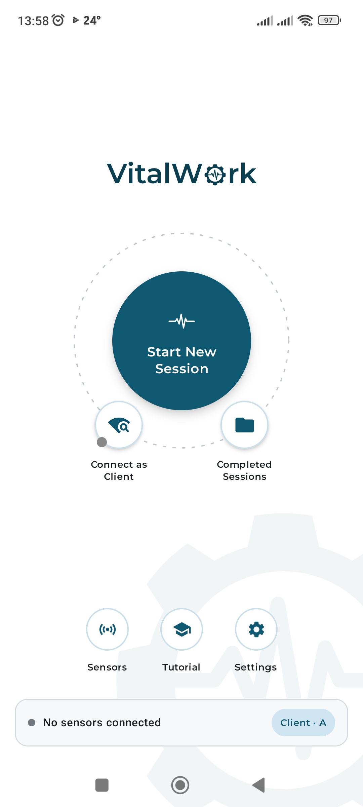
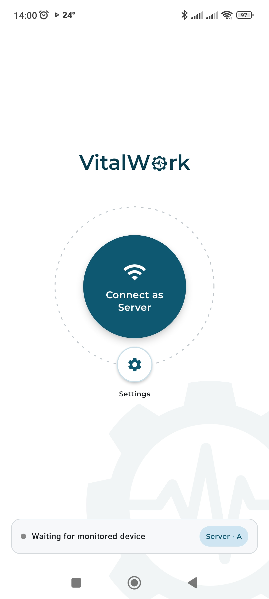
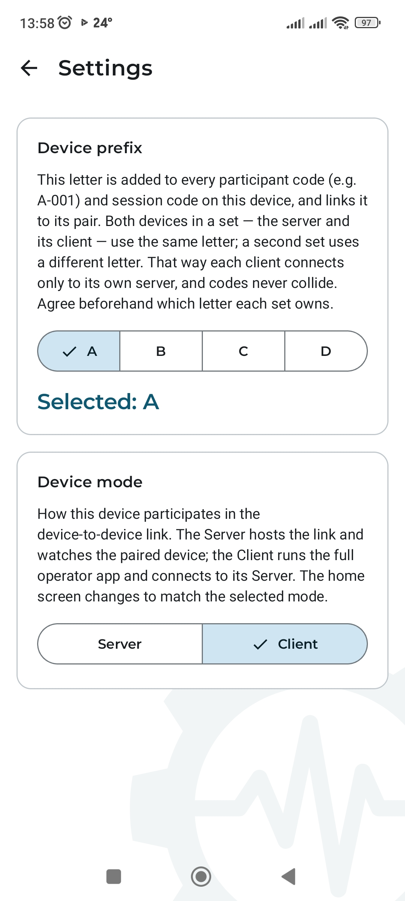
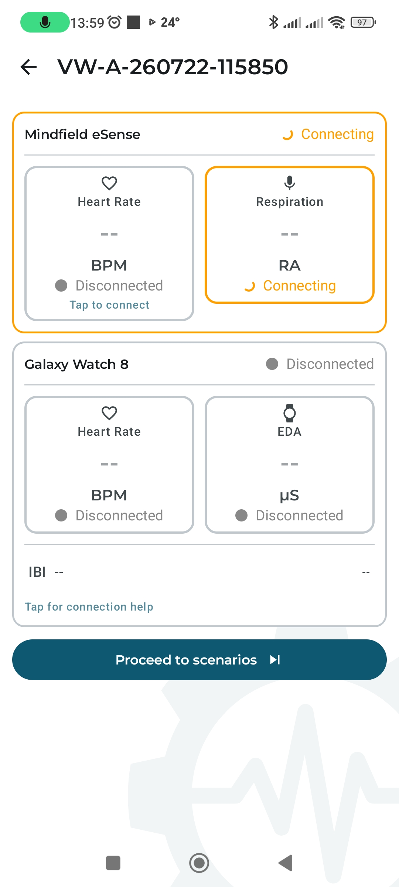
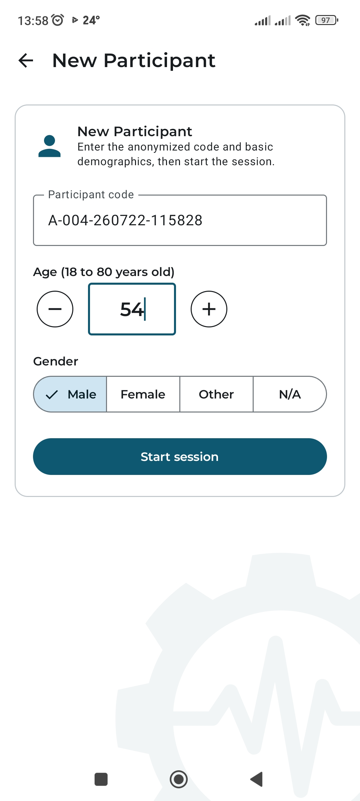
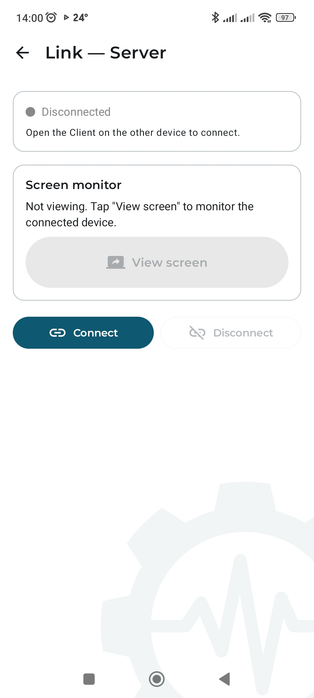
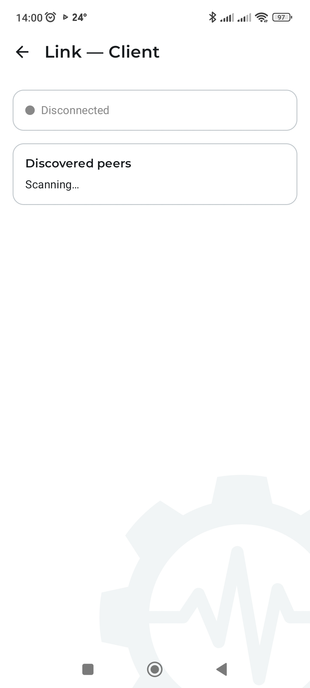
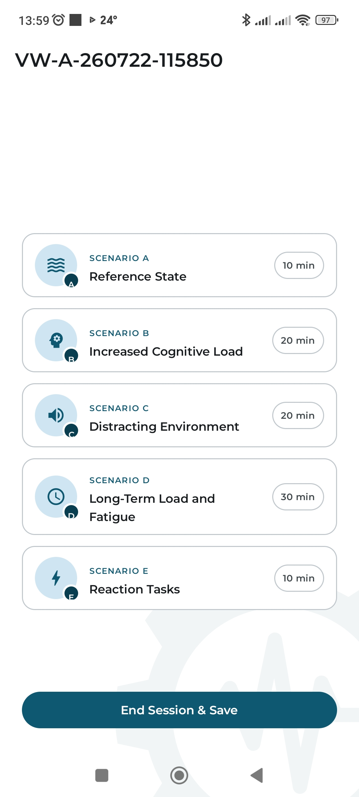
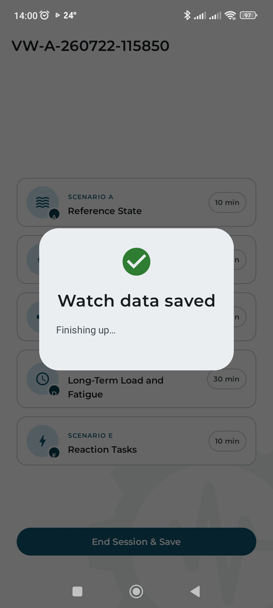
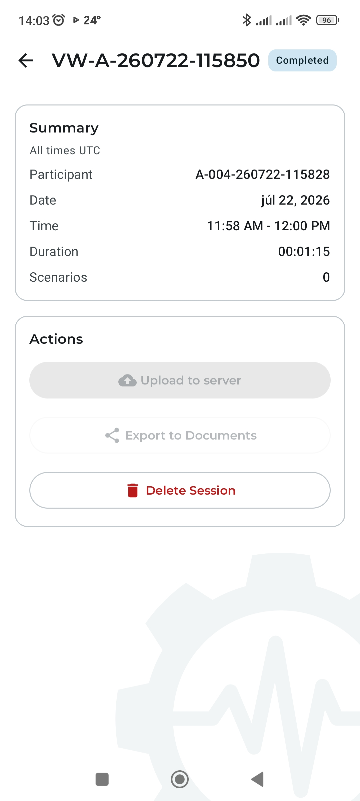

# Operational Manual — VitalWork Sensor Control Module

**Project:** RAP_126 — Development of a prototype sensor control module for monitoring operator
physiological state during simulated work scenarios
**Document version:** 1.0
**Date:** 2026-07-22
**Intended for:** The measurement operator (device operator during a test session)

---

## Contents

1. [System and device overview](#1-system-and-device-overview)
2. [Preparation before measurement](#2-preparation-before-measurement)
3. [Launching the app and initial setup](#3-launching-the-app-and-initial-setup)
4. [Connecting the sensors](#4-connecting-the-sensors)
5. [Creating a participant and starting a session](#5-creating-a-participant-and-starting-a-session)
6. [Pairing the second device (screen mirroring)](#6-pairing-the-second-device-screen-mirroring)
7. [Running the measurement — scenarios A–E](#7-running-the-measurement--scenarios-ae)
8. [Ending the session and exporting data](#8-ending-the-session-and-exporting-data)
9. [Troubleshooting common problems](#9-troubleshooting-common-problems)

---

## 1. System and device overview

*See diagram 01 — System architecture:* `diagrams/png/01_system_architecture_en.png`

The VitalWork system consists of the following devices the operator prepares and controls:

| Device | Role during measurement |
|--------|-------------------------|
| **Android tablet/phone** (Client) | Runs the VitalWork app; connects the sensors; records and uploads the session |
| **eSense Pulse** (chest strap) | Measures heart rate and R-R intervals over BLE |
| **eSense Respiration** (chest strap) | Measures respiration amplitude over the tablet's audio jack |
| **Galaxy Watch 8** | Measures EDA, heart rate and IBI; worn by the participant |
| **Second Android device** (Server, optional) | Watches the Client's live screen over the local Wi-Fi link — useful when the operator is not next to the participant |

> **Important:** each tablet is set to exactly one role for the device-to-device link — **Client**
> (runs the full app: sensors, sessions, scenarios) or **Server** (hosts the link and only watches the
> Client's screen). Most sessions only need the Client; the Server device is optional and only
> relevant when a second operator wants to monitor remotely.

---

## 2. Preparation before measurement

### 2.1 Checklist before every session

- [ ] Tablet/phone charged (recommended ≥ 80 %)
- [ ] Galaxy Watch charged (recommended ≥ 50 %; the app shows a low-battery warning)
- [ ] eSense Pulse charged and working (indicator lit)
- [ ] eSense Respiration plugged into the tablet's audio jack
- [ ] **Bluetooth on the tablet is on** (required for both the eSense Pulse BLE link and the Galaxy
      Watch Data Layer)
- [ ] Location services on the tablet are on (required by Android for BLE scanning)
- [ ] Notification permission granted (needed for the foreground service that keeps the session alive)
- [ ] If using the second device for screen mirroring: both devices on the **same Wi-Fi network**

### 2.2 Fitting the sensors on the participant

1. **eSense Pulse** — fit the chest strap with the electrodes in the correct position; wait at least
   a few seconds after the BLE connection before recording begins so the signal stabilizes.
2. **eSense Respiration** — fit the chest strap; plug the cable into the tablet's audio jack.
3. **Galaxy Watch 8** — fit it on the participant's wrist; check that the Wear companion app is
   running (it shows as a foreground "health" service on the watch).

---

## 3. Launching the app and initial setup

### 3.1 First launch — choosing the device mode

On first launch the app asks whether this device is **Server** or **Client**. Pick **Client** for the
device that runs the measurement (sensors, sessions, scenarios); pick **Server** only for a second
device that will watch the Client's screen remotely. The choice is remembered — later launches go
straight to Home. It can be changed any time in **Settings**.

### 3.2 Home screen (Client mode)

*Screenshot: Home screen, Client mode*
{width=2.3in}

| Element | Purpose |
|---------|---------|
| **Start New Session** | Creates a new participant and starts a session — the main working action |
| **Connect as Client** | Opens the device-to-device link so a Server device can watch this screen |
| **Completed Sessions** | Review, export and upload of finished sessions |
| **Sensors** (bottom) | Connection and live status of sensors — used before a session or for diagnostics |
| **Tutorial** (bottom) | Introductory guide — one-time reading |
| **Settings** (bottom) | Device prefix and device mode |
| Status card (bottom) | At-a-glance readiness: sensors connected, active session, or setup warnings |

> **During normal operation** the operator mainly uses **Start New Session** and **Completed
> Sessions**. The other items are for one-time setup or diagnostics.

### 3.3 Home screen (Server mode)

*Screenshot: Home screen, Server mode*
{width=2.3in}

A device in Server mode shows only **Connect as Server** and **Settings** — hosting the link and
watching the paired device's screen is its only job; it does not run sessions or sensors itself.

### 3.4 One-time setup — device prefix and mode

*Screenshot: Settings — device prefix and device mode*
{width=2.3in}

Before the first session, open **Settings** and pick this device's prefix: **A**, **B**, **C** or
**D**. The prefix is added to every participant code (e.g. `A-001`) and session code
(`VW-A-yyMMdd-HHmmss`) generated on this device, and it also scopes the device-to-device link to one
pair.

> **Rule:** both devices of a pair (Client + its Server) use the **same** letter; a different pair
> uses a different letter. That way each Server only links to its own Client and codes never collide
> when several tablets test in parallel. Agree beforehand which letter each pair owns, and do not
> change it mid-study.

The same screen also holds the **Device mode** switch (Server/Client) described in §3.1 — changing it
here re-shapes the Home screen immediately on return.

---

## 4. Connecting the sensors

### 4.1 eSense Pulse (BLE)

1. On the sensor-setup screen (see §5), tap the **Heart Rate** card (or go to **Sensors → eSense
   Pulse**).
2. The app scans for BLE devices — select the one whose name starts with `eSense` from the list.
3. Once connected, the live heart-rate value (BPM) and R-R intervals are shown.

> If the device is not found: check that Bluetooth and Location Services are enabled on the tablet.

### 4.2 eSense Respiration (audio jack)

The sensor activates automatically once plugged into the audio jack. Check on the sensor-setup screen
that the **Respiration** card shows a live value (unit: **RA**, raw respiration amplitude — not
breaths per minute). A breathing-rate estimate (br/min) appears after roughly 15 seconds of clean
signal; until then the display shows `--`.

The app watches the signal quality continuously and shows a warning banner when something is wrong:

- **Respiration signal lost** — the strap has slipped off the chest (the RA value collapses).
  Re-seat the chest strap.
- **No breathing detected** — the strap is on but is not tracking breathing (e.g. worn too loose).
  Tighten and reposition the strap.

### 4.3 Galaxy Watch 8

1. Make sure Bluetooth is on — the watch link runs over direct Bluetooth, not Wi-Fi.
2. Check the **Galaxy Watch 8** card status: **Connected** (live data), **Watch dozing — buffering**
   (the watch screen is off — data is being stored on the watch, not lost), or **Disconnected**.
3. The **dozing** state is normal whenever the watch screen is off — the buffered data is sent back to
   the tablet automatically at the end-of-session flush (see §8.1).

> If the status stays **Disconnected**: check that Bluetooth on the tablet is on and that the watch's
> companion app is running.

*Screenshot: Sensor-setup screen — Mindfield eSense (connecting) and Galaxy Watch 8 (disconnected)*
{width=2.3in}

---

## 5. Creating a participant and starting a session

1. On the Home screen, tap **Start New Session**.

   > **If the button is grayed out** with the note *"Fix the warnings above to start"*, the tablet is
   > missing a setting the session cannot safely run without — the **battery-optimization exemption**
   > or the **notification permission** (without them, the system can silently kill the recording
   > while the screen is off and the whole session would be lost). Use the **Fix** buttons in the
   > warning card at the top of the Home screen; the button unlocks as soon as both are granted.
   > Resuming an already-running session is never blocked.

2. The **New Participant** form appears:
   - **Participant code** — automatically generated (e.g. `A-004-260722-115828`). Read-only — do not
     try to edit it.
   - **Age** — the participant's age (18–80 years); use the − / + buttons to set it.
   - **Gender** — Male / Female / Other / N/A.
3. Tap **Start session**.

*Screenshot: New Participant form*
{width=2.3in}

4. The app opens the **sensor-setup screen** — a one-time check to confirm sensors before recording
   starts (see §4 and the screenshot above). Tap **Proceed to scenarios** once the sensors you need are
   connected. The button stays disabled (with the hint *"Connect at least one sensor to continue."*)
   until **at least one sensor is connected** — this prevents starting a scenario that would record no
   data. Disconnected sensors show a dashed border with a **Tap to connect** pill; tapping anywhere on
   such a card starts its connection flow.

> A foreground service keeps the sensors and (if enabled) the device link alive even while the tablet
> screen is off, so the operator does not have to hold the tablet continuously.

---

## 6. Pairing the second device (screen mirroring)

> This step is **optional** — only needed if a second operator wants to watch the Client's screen
> remotely. Skip this section for a single-tablet session.

### 6.1 Pairing procedure

1. On the **Server** device, tap **Connect as Server**, then **Connect**. The status shows
   *Waiting for monitored device*.

   *Screenshot: Link — Server, before connecting*
   {width=2.3in}

2. On the **Client** device, tap **Connect as Client**. It scans for the Server over mDNS.

   *Screenshot: Link — Client, scanning*
   {width=2.3in}

3. On the Client, tap the discovered device in **Discovered peers**, then tap **Connect**. Both
   screens turn to a green **Connected** status once the WebSocket link is up.
4. On the Server, tap **View screen** — the Client device shows Android's screen-capture consent
   dialog. Once accepted, the Client's screen streams live to the Server, peer-to-peer over Wi-Fi
   (WebRTC) — no data leaves the local network.

### 6.2 Recovering the connection after a dropout

If the Wi-Fi link drops, reconnect using the same steps as above — Connect on the Server, then select
the discovered device on the Client. A dropout does not affect the session or sensor recording on the
Client — screen mirroring is a monitoring aid, not part of the measurement itself.

---

## 7. Running the measurement — scenarios A–E

### 7.1 The scenario hub

After the sensor-setup screen, the **scenario hub** is shown — one card per scenario, plus
**End Session & Save** at the bottom.

*Screenshot: Scenario hub*
{width=2.3in}

| Scenario | Duration | Purpose |
|----------|----------|---------|
| **A — Reference State** | 10 min | Baseline measurement, no induced load |
| **B — Increased Cognitive Load** | 20 min | Mental workload condition |
| **C — Distracting Environment** | 20 min | Environmental distraction condition |
| **D — Long-Term Load and Fatigue** | 30 min | Extended-duration fatigue condition |
| **E — Reaction Tasks** | 10 min | Reaction-based task condition |

### 7.2 Running one scenario

1. Tap a scenario card. Recording **starts automatically** — no separate Start button.
2. A countdown ring shows the time remaining; the top bar turns red with a pulsing **REC** badge and
   the elapsed time. The app also locks touch input and hides the system bars, so it is safe to set
   down or pocket the tablet during the run.
3. When the countdown reaches zero, the scenario **stops and finalizes automatically** and the app
   returns to the scenario hub. A finished scenario shows a green check and its letter badge turns
   green.
4. Repeat for each scenario the protocol requires. Scenarios can be run in any order and each can be
   re-run if needed — the hub always shows which ones already have a recorded run.

> If a sensor disconnects mid-scenario, a banner appears ("… disconnected — Recording continues —
> reconnect to resume data capture"). The scenario keeps its timer running; reconnect the sensor as
> soon as possible to minimize the gap in that scenario's data.

> If a scenario is opened with **no sensor connected at all** (for example, a sensor dropped between
> setup and the scenario), a **"No sensor connected"** banner appears and neither the recording nor
> the countdown starts. Nothing is lost — connect a sensor and the scenario begins normally.

---

## 8. Ending the session and exporting data

### 8.1 Ending the session

1. From the scenario hub, tap **End Session & Save**, then confirm.
2. If the Galaxy Watch has buffered data, the app asks the operator to **wake the watch** (tap its
   screen) so it can send back everything it stored during the session.
3. Once the transfer completes, a green check confirms **Watch data saved**, and the app continues
   automatically to the session review screen.

   *Screenshot: End-session confirmation*
   {width=2.3in}

   > If the watch does not respond, **End without watch data** is available — the watch keeps its
   > stored data safely and it can be recovered on a later session; no data is lost, only delayed.

### 8.2 Review, export and upload

The app opens the **session review** screen automatically.

*Screenshot: Session review*
{width=2.3in}

| Action | Effect |
|--------|--------|
| **Upload to server** | Sends the full session (participant + scenarios + samples) to the VitalWork server. Safe to repeat — repeating it does not duplicate data (the server recognizes the session by its code). |
| **Export to Documents** | Writes a local JSON + CSV copy to the tablet's Documents folder. Independent of upload status. |
| **Delete Session** | Permanently removes the session — only after it has been exported or uploaded. |

> If the upload fails (e.g. no network), tap **Upload to server** again once connectivity is restored.

---

## 9. Troubleshooting common problems

| Problem | Possible cause | Solution |
|---------|----------------|----------|
| eSense Pulse is not found | Bluetooth off, Location Services off | Turn on Bluetooth and Location Services |
| eSense Respiration shows no data | Cable not plugged in correctly | Unplug and re-plug the audio jack |
| "Respiration signal lost" banner | Chest strap slipped off the chest | Re-seat the chest strap; the banner clears once the signal returns |
| "No breathing detected" banner | Strap worn too loose — not tracking chest movement | Tighten and reposition the strap |
| Galaxy Watch shows Disconnected | Bluetooth on the tablet is off, or the watch's companion app is not running | Turn on Bluetooth; restart the app on the watch |
| Galaxy Watch shows "dozing — buffering" | The watch screen is off (normal state) | No action needed — data is being stored; the end-session flush retrieves it |
| Device link — Client can't find the Server | Devices not on the same Wi-Fi network, or Server not started | Confirm both are on the same Wi-Fi; tap Connect on the Server first |
| Screen mirroring shows nothing | Screen-capture consent was denied on the Client | On the Server, tap View screen again; on the Client, accept the system consent dialog |
| Upload to server failed | No Wi-Fi / weak connection | Retry once connectivity is restored; the upload is safe to repeat |
| Tablet disconnects sensors after a while | Battery optimization killing the background service | In system Settings, exempt VitalWork from battery optimization |

---

*This document is part of the formal output of project RAP_126, Activity 2 (modelling / simulation).*
*The full session workflow is shown in diagram 02:* `doc/grant_RAP_126/diagrams/png/02_operator_session_workflow_en.png`
